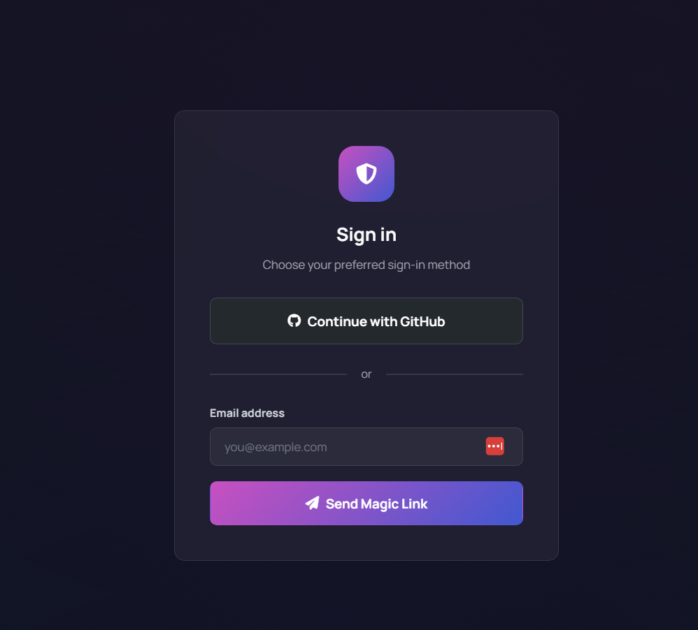
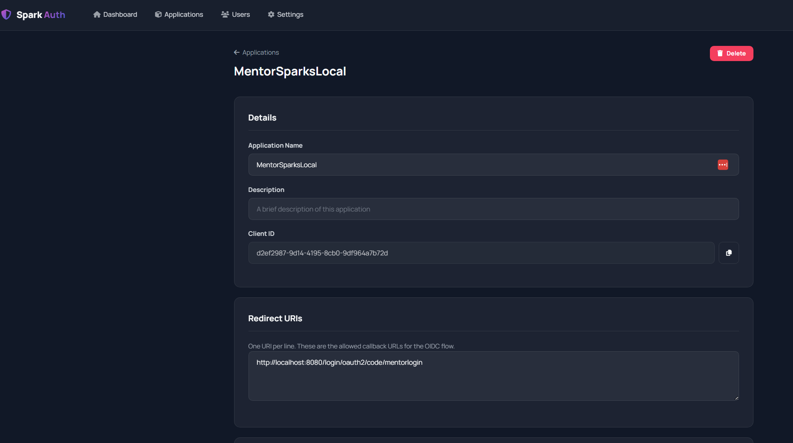
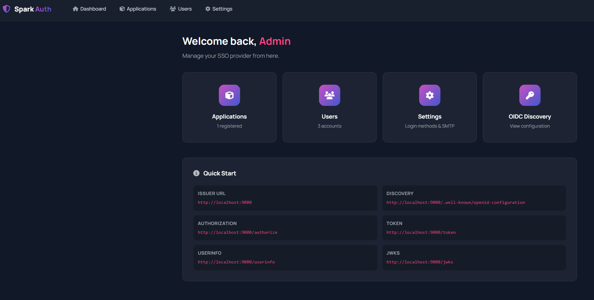

# SparkAuth SSO Login Provider

A self-hosted OIDC (OpenID Connect) identity provider built with Go, Gin, and PostgreSQL. 

## Goals
- easy to install/setup and use
- just the things I need for mentorsparks.com SSO 


## Features

- **OIDC Provider**: Full OpenID Connect authorization code flow with PKCE support
- **Email Magic Link**: Passwordless sign-in via email
- **GitHub OAuth**: Sign in with GitHub
- **Admin Dashboard**: Manage applications, users, and settings
- **Glass Morphism UI**: Dark theme with modern design

## Screenshots



*Login page with email magic link option.*



*Admin page*




*Admin dashboard for managing users and applications.*

## Quick Start

### Prerequisites
- Go 1.23+
- PostgreSQL

### Setup

1. Create the database:
   ```sql
   CREATE DATABASE sparkauth;
   ```

2. Copy and configure environment:
   ```bash
   cp .env.example .env
   # Edit .env with your database URL and admin email
   ```

3. Run:
   ```bash
   go mod tidy
   go run .
   ```

4. Open http://localhost:9000/admin — log in with the admin email (via magic link printed to console)

### Running with Docker Compose

If you prefer using Docker:

1. Ensure Docker and Docker Compose are installed.

2. Run:
   ```bash
   docker compose up
   ```

3. Open http://localhost:8080/admin — log in with the admin email (via magic link printed to console)

The database will be automatically created and configured.

## OIDC Endpoints

| Endpoint | URL |
|----------|-----|
| Discovery | `/.well-known/openid-configuration` |
| Authorization | `/authorize` |
| Token | `/token` |
| UserInfo | `/userinfo` |
| JWKS | `/jwks` |

## Registering an Application

1. Go to Admin → Applications → New Application
2. Set a name and redirect URI(s)
3. Copy the Client ID and Client Secret
4. Configure your app with:
   - **Issuer**: `http://localhost:9000`
   - **Client ID**: from step 3
   - **Client Secret**: from step 3
   - **Redirect URI**: must match one registered
   - **Scopes**: `openid profile email`


## Planned features
- Email templates (per application)
- multitenacy


## Used at
- https://mentorsparks.com

## License

This project is licensed under the MIT License - see the [LICENSE](LICENSE) file for details.
